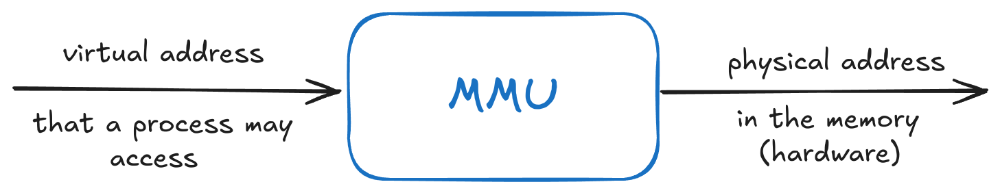
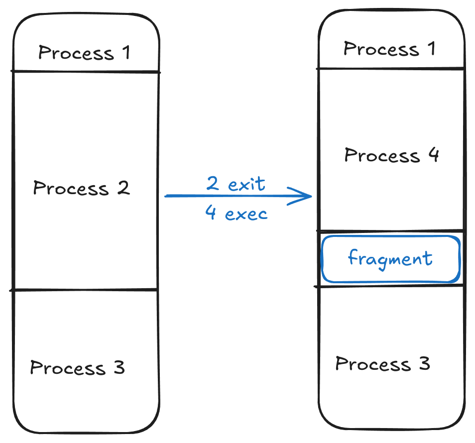
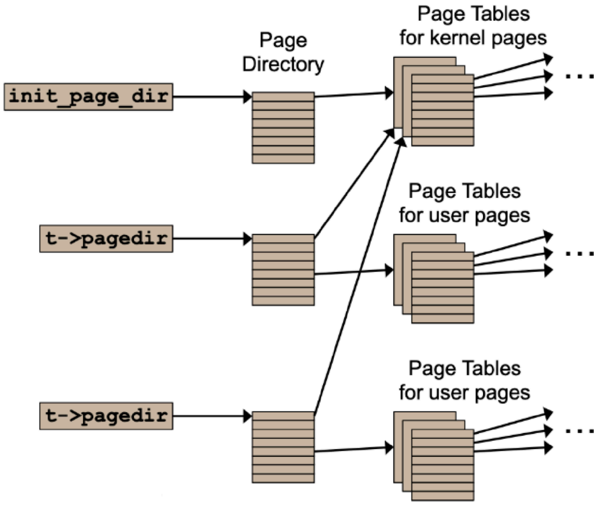

<div style="display: flex; justify-content: center; align-items: center; height: 700px;">
  <div style="text-align: center; padding: 40px; background-color: white; border: 2px solid rgb(0, 63, 163); border-radius: 20px; box-shadow: 0 0 20px rgba(0,0,0,0.1);">
    <h1 style="font-size: 48px; font-weight: bold; margin-bottom: 20px; color: #333;">CS130 Operating Systems Tutorial</h1>
    <p style="font-size: 24px; color: #666;">Intro to Project 3</p>
    <p style="font-size: 16px; color: #999; margin-top: 20px;">Hengyu Ai | 2024-11-20</p>
  </div>
</div>

<!--s-->

<div class="middle center">
  <div style="width: 100%">

  # Part.0 Reminder
  
  </div>
</div>

<!--v-->

## Project

- Project 3 Due: Dec. 7 at 23:59, start early!
- The most challenging project among the four
- You need a working Project 2 to start Project 3
- Checkout design document and you may be inspired

</br>

- Remember to leave some time for merging to `main` branch
  - Manually resolve conflicts
  - Hard reset and then merge
- Weekly commit

<!--s-->

<div class="middle center">
  <div style="width: 100%">

  # Part.1 Background
  
  </div>
</div>

<!--v-->

## Intention of Process

- **Process**: a program in execution
  - virtualization: each process has a large virtual address space <!-- .element: class="fragment" -->
  - isolation: each process is isolated from each other <!-- .element: class="fragment" -->
  - concurrency: multiple processes run concurrently on the same machine <!-- .element: class="fragment" -->

<div class="fragment">

To achieve these goals, we need to **save and restore** the state of each process.

And luckily, all the states we need is memory.

</div>

<div class="fragment">

**Naive Approach**: save the entire memory of the process

- What about the processes that are not running?
- Just store them in external storage, e.g. disk

**Advantages**: simple, and real isolation

**Disadvantages**: external storage is slow, a process may not need that much memory

</div>

<!--v-->

## Intention of Process (Cont'd)

For better performance, store states of almost all processes in memory.

<div class="fragment">

**How to isolate processes?**

Hardware support: **Memory Management Unit (MMU)**



</div>

<div class="fragment">

MMU has a table for each process, which maps virtual address to physical address.

- When a process is running, MMU uses the table of that process
- In context switch, MMU switches to the table of the next process
- Thus, states are stored in memory, and also isolated

</div>

<!--v-->

## Process, But Better Performance

Remember testcase **multi-oom** in Project 2?

<div class="fragment">

Project 2 memory allocation strategy:

- Allocate a 4KB stack for each process
- Allocate as much memory for global and static segments as needed
- `malloc` / `new` not supported

</div>

<div class="fragment">

**Problems**:

1. Some processes may take up too much memory
1. Too much allocation and deallocation, more overhead
1. Some segments are barely used during whole process lifetime

</div>

<!--v-->

## Solution to Problem 1

Too much memory allocated? Allocate less!

<div class="fragment">

Suppose we hace some kind of "oracle" of actual memory usage of each process. Then we can just allocate when needed.



</div>

<!--v-->

## Solution to Problem 1 (Cont'd)

There are two issues about the solution above:

1. There is no such "oracle"
2. Memory fragmentation

<div class="fragment">

**Solution**: Paging

- Divide memory into fixed-size, small chunks, called **pages**.
- A page is the smallest unit of memory allocation.
- Allocate a page when needed.
- In PintOS, the size of a page is 4KB.

</div>

<!--v-->

## Solution to Problem 2

Since we do not know which pages will be used, we allocate no pages at the beginning. Instead, we simply mark ranges of virtual addresses as "accessible".

<div class="fragment">

When MMU tries to access a virtual address that is not accessible:

- Maybe the page is valid but not yet allocated, allocate it
- Maybe the page is not valid, stop the process

</div>

</br>

<div class="fragment">

All the allocation above is also under the paging strategy we just introduced.

</div>

<!--v-->

## Solution to Problem 3

Recall the naive approach of saving the entire memory of a process.

<div class="fragment">

Why this is not a good idea: disk is slow.

Current case: some pages are barely used `->` we can store them in disk and save memory for pages that are frequently used.

</div>

<div class="fragment">

This is called **swap**.

- Swap can also provide an illusion of infinite memory.
- Disk is still much slower than memory, so a swapping strategy is crucial.

<!--s-->

<div class="middle center">
  <div style="width: 100%">

  # Part.2 Implementation
  
  </div>
</div>

<!--v-->

## Implement the Great Things Above

In conclusion, what we need is:

<div class="fragment">

1. **Paging**: divide memory into pages, use page as allocation unit
2. **Table**: memory mapping for each process, MMU looks up the table and does the address translation
3. **Swap**: store pages in disk, swap pages in and out when needed

</div>

<!--v-->

## Virtual Address

4KB = $2^{12}$ bytes, so we need 12 bits to represent the offset in a page.

The rest bits are used to represent the page number.

```
    31       ...      12 11   ...   0
    +-------------------+-----------+
    |    Page Number    |   Offset  |
    +-------------------+-----------+
            Virtual Address
```

We can separate the page number and build a two-level page table.

```
    31      ...       22 21  ...   12 11   ...    0
    +-------------------+------------+------------+
    | Page Directory Idx| Page Table |   Offset   |
    +-------------------+------------+------------+
                Virtual Address
```

<!--v-->

## Page Fault


<!--s-->

<div class="middle center">
  <div style="width: 100%">

  # Part.3 Project 3 Overview
  
  </div>
</div>

<!--v-->

## You Need a Robust Project 2

- All test cases in Project 2 should pass
- All test cases in Project 3 are user programs, your syscall should work correctly
- Passing 80 test cases does not mean your Project 2 part will not crash in Project 3


Be careful with the following parts:

- Memory allocation: free the memory when the process exits/crashes
- Check User Pointer: check whether the pointer is valid (the second approach in the document is recommended in Project 3)

<!--v-->

## Paging in PintOS

- 4 KB page size
- Paging is supported by hardware, we are not able to modify the structure of the page table/page directory, but consider the following cases:
  - A page is not present because it is not yet allocated
  - A page is not present because it is swapped out
  - A page is not present and this pags is from mmap
- To distinguish the above cases, we need to add some extra information
- Supplementary page table

Information in supplementary page table:

- user virtual address (for installing the page)
- type of the page (for distinguishing the above cases)
- ...

<!--v-->

## Page Directory and Page Table



All processes share the same kernel memory mapping in `init_page_dir`, and this is why the memory allocated by `malloc` is not isolated.

<!--v-->

## Handling Page Fault

When a page fault occurs, page fault handler (`exception.c/page_fault()`) is called.

3 flags:

- `not_present`: the page is not present
- `write`: the access that caused the fault was a write
- `user`: the access that caused the fault was in user mode

Use the flags and the information in the supplementary page table to handle the page fault.

Fro example, if the page is not present because it is not yet allocated, allocate the page and install it, if the page is not present because it is swapped out, swap it in.

<!--v-->

## Task 1: Paging

- Implement the paging strategy in PintOS
- `palloc_get_page()`, use flag `PAL_USER` to allocate a page from user pool
- lazy loading: allocate a page when needed
- dirty bit: mark the page as dirty when it is written
  - swap out the page if it is dirty
  - otherwise, just free the page, because the page can be loaded from the executable file
- evict a page if there is no free page

Challenge: how to evict a page? (potential concurrency bugs) how to find information of the corresponding page by the virtual address? how to swap out a page and manage the swap space?

Some interfaces you may need to implement: frames (allocate pages and evict present pages), swap (swap in and out pages), supplemental page table (store information of the page and look up by virtual address)

<!--v-->

## Task 2: Stack Growth

The stack may grow and exceed the initial size (1 page) allocated by the kernel.

When the stack grows, a page fault occurs, you should judge whether the page fault is caused by the stack growth.

If true, allocate a new page for the stack and install it.

Stack pages may be evicted, so you need to implement swappping for stack pages.

Challenge: how to distinguish the page fault caused by the stack growth?

<!--v-->

## Task 3: Memory Mapped Files

map/unmap a file to memory.

When evicting a mmaped page, you should write the content back to the file instead of swapping it out.

Challenge: potential deadlocks when accessing user memory.

<!--v-->

## Task 4: Accessing User Memory

Make sure the user memory is valid before accessing it.

Challenge: think of the following cases:

Some functions in device drivers are not thread-safe (should not be called nestedly), when process A calls `read`, it calls driver of disk, and at this moment, process B evicts a page that originally belongs to buffer of `read` in A, a page fault occurs when A is still in the driver, and the page fault handler tries to swap in, which calls driver of disk again.

You can implement a "pinning" mechanism for frames to avoid this.

<!--v-->

## Add Source Files

`vm/` directory is almost empty now. You need to add your source files to `vm/` directory.

To compile your source files, modify `Makefile.build`

```makefile
# User process code.
userprog_SRC  = userprog/process.c	# Process loading.
userprog_SRC += userprog/pagedir.c	# Page directories.
userprog_SRC += userprog/exception.c	# User exception handler.

...

SOURCES = $(foreach dir,$(KERNEL_SUBDIRS),$($(dir)_SRC))
```

You do not need to modify Makefile if you only add `.h` files.

`$(dir)_SRC` maches all the subdirectories in `KERNEL_SUBDIRS`, therefore, `threads_SRC`, `userprog_SRC`, `vm_SRC`, `filesys_SRC`, are all included.

<!--s-->

<div style="display: flex; justify-content: center; align-items: center; height: 700px;   ">
  <div style="text-align: center; padding: 40px; background-color: white; border-radius: 20px; box-shadow: 0 0 20px rgba(0,0,0,0.1);">
    <div style="display: inline-block; padding: 20px 40px; border-radius: 10 px; margin-bottom: 20px;">
      <h1 style="font-size: 48px; font-weight: bold; margin: 0; color: rgb(16, 33, 89)">Thanks for Listening</h1>
    </div>
    <p style="font-size: 24px; color: #666; margin: 0;">Any questions?</p>
  </div>
</div>
