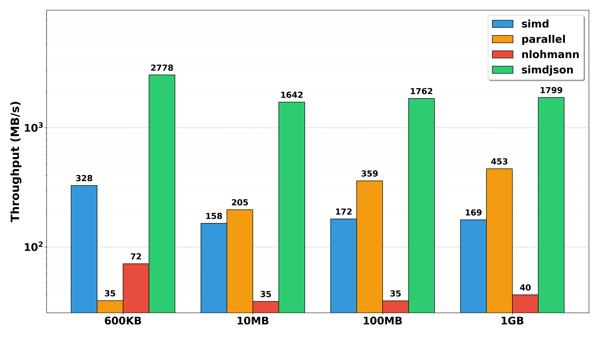

<div style="display: flex; justify-content: center; align-items: center; height: 700px;">
  <div style="text-align: center; padding: 40px; background-color: white; border: 2px solid rgb(0, 63, 163); border-radius: 20px; box-shadow: 0 0 20px rgba(0,0,0,0.1);">
    <h1 style="font-size: 48px; font-weight: bold; margin-bottom: 20px; color: #333;">Parallel JSON Parser</h1>
    <p style="font-size: 24px; color: #666;">CS121 Programming Project</p>
    <p style="font-size: 16px; color: #999; margin-top: 20px;">Hengyu Ai, Sizhe Zhao | 2025-12-30 </p>
  </div>
</div>

<!--s-->

<div class="middle center">
  <div style="width: 100%">

  # Part.1 Background & Motivation
  
  </div>
</div

<!--v-->

## JSON is Everywhere

- Portable, simple, represents almost any data structure.
- Used by ~97% of API requests.

```json
{
    "course": "CS121",
    "students": [
        {"name": "Hengyu Ai"},
        {"name": "Sizhe Zhao"}
    ]
}
```

<div class="fragment">

**Downside?**

- Reading and writing JSON can be slow. E.g., 40 MB/s - 100MB/s
- Slower than fast disks or fast networks
- More and more latge JSON files (chrome trace files, coco dataset, etc.)

</div>

<!--v-->

## Bottleneck

Traditional parsers are inherently **serial**.

<br/>

- LL(Recursive descent): a lot of backtracking.
- LR: state machine, unpredictable branching.x

<br/>

- Throughput is limited by single-core clock speed.
- Parsing GBs of JSON sequentially is unacceptable.

Goal: Utilize multi-core architectures to accelerate JSON parsing.

<!--s-->

<div class="middle center">
  <div style="width: 100%">

  # Part.2 Parallelized Parsing
  
  </div>
</div>

<!--v-->

## The Challenge of Parallelism

- Ideal scenario: monoidal structure (e.g., parenthesis sequences)
  - data = unparsed prefix + parsed middle + unparsed suffix
  - if parsing is asscociative, we can split input and parse in parallel.

<div class="fragment">

- Reality: JSON has context dependence.
  - State Toggle: Characters like `{`, `}`, or `,` have different meanings depending on whether they are inside a string.
  - Example: `{"key": "value, with comma"}`
  - We need a complex state machine to merge unparsed segments correctly.
  - We need to parse more than once (e.g., once with string context, once without).

</div>

<div class="fragment">

- The "Split" Problem: if we can split JSON into proper independent chunks, we can parse parallelly and merge results easily.

</div>

<!--v-->

## The Solution Overview

- **Inspiration**: Derived from simdjson and Mison research.
- **Core Philosophy**: Decouple structure identification from value parsing.
- **Pass 1**: Structural Indexing (Data Parallel)
  - Scan raw bytes to identify structural characters (`{` `}` `[` `]` `:` `,`).
  - Handle quotes and escapes globally.
- **Pass 2**: DOM Construction (Task Parallel)
  - Use indices to safely split the workload.
  - Parse values in parallel without context ambiguity.

<!--v-->

## Phase 1: Structural Indexing

- **Objective**: Identify structural characters while ignoring contents inside quotes.

- **Bit-Level Parallelism**:
  - Instead of branching on every char, process blocks (e.g., 64-bit words).
  - **Algorithm**:
    - Identify all `"` (quotes) and `\` (escapes).
    - Compute a Mask via XOR / Prefix Sum operations.
    - Mask indicates: "Am I inside a string?"
  - **Result**: A flat vector of structural indices.
    - Transforms context-dependent stream into context-free locations.

<!--v-->

## Phase 2: DOM Construction

- **Objective**: Build the JSON DOM using structural indices.
- **Thread-Level Parallelism(OpenMP)**:
  - Split top-level structures (objects/arrays) based on indices.
  - Each thread parses its assigned segment independently. (Simple stack-based parser)
  - Merge parsed segments into a complete DOM.
    - Offsets can be parallelly computed.
    - Write results parallelly into preallocated memory.

<!--s-->

<div class="middle center">
  <div style="width: 100%">

  # Part.3 Implementation Details
  
  </div>
</div>

<!--v-->

## "Tape" architecture

- Inspired by simdjson's "tape" design.
- **Objective**: Replace slow pointer-chasing with flat arrays.
- **Design**:
  - Use a flat array (tape) to store parsed values sequentially.
  - Each entry encodes type and value (e.g., integer, string, object start).

<!--v-->

## Memory Management

- **Zero-Copy Parsing**:
  - Never copy raw input data, use `std::string_view`
- **Preallocation**:
  - Estimate memory needs based on structural indices.
  - Preallocate an arena `std::pmr::monotonic_buffer_resource` for fast allocation.

<!--s-->

<div class="middle center">
  <div style="width: 100%">

  # Part.4 Performance Evaluation
  
  </div>
</div>

<!--v-->

## Benchmarks

- Implementations:
  - Only SIMD
  - SIMD + OpenMP (Our full solution)
- Baselines:
  - Industry-standard library: nlohmann/json
  - High performance library: simdjson
- Datasets:
  - 600KB, 10MB, 100MB, 1GB JSON files

<!--v-->

## Results



<!--s-->

## Summary

- Inspiration: identify and separate context-dependent parsing from structure identification.
- Two-pass algorithm: structural indexing + parallel DOM construction.
- Performance: Significant speedup over traditional parsers
  - OpenMP implementation is slower in small files due to overhead.
- Bottleneck: memory bandwidth and synchronization overhead.
- Why simdjson is faster?
  - More optimized SIMD code
  - Hard-coded parsing tables and magic numbers
- It's hard to reuse these optimizations in a general parser, but the monoidal way mentioned earlier is still applicable.
