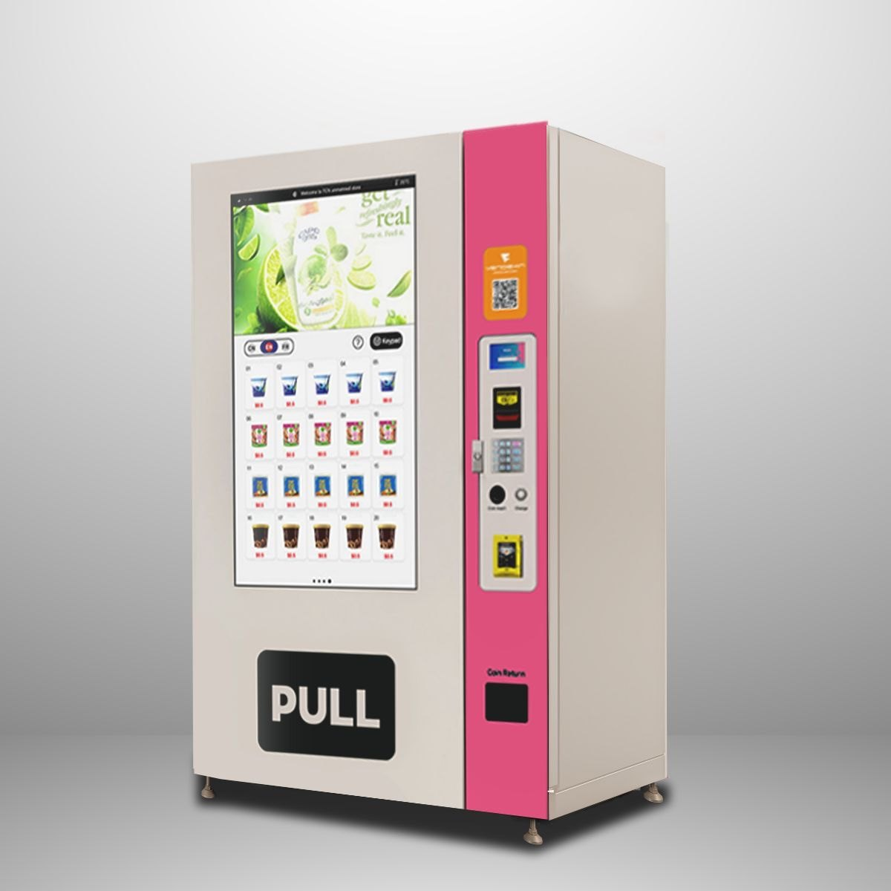
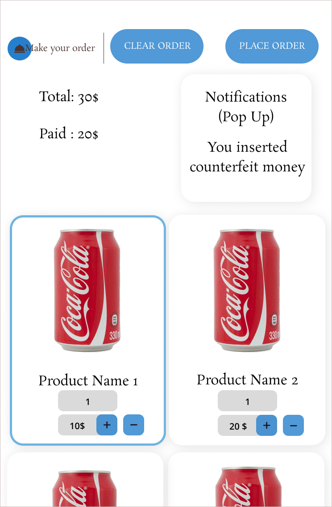

  

    <h1 style="font-size: 48px; font-weight: bold; margin-bottom: 20px; color: #333;">Vending Machine Project Report</h1>
    
Phase 1: Requirements

    
Hengyu Ai | 2025-04-09 

  

<!--s-->

  

  # Part.1 Interface
  
  

<!--v-->

## Machine Interface

- Panel with serveal hardware
  - Coin insert
  - Cash insert
  - Collect change
  - Return fake coin/cash
  - Keyhole for maintenance
- Case at the bottom
  - Collect goods
- Maintenance interface
  - Available if the machine is open

<!--v-->

## Screen UI

- The main screen (touch screen)
  - Add/Remove products to cart
  - Clear cart
  - Checkout
  - Display notification
    - Fake coin/cash
    - No merchandise
    - Money not enough
    - ...
  - Show product information
    - Name
    - Price
    - Image

<!--s-->

  

  # Part.2 Sensors
  
  

<!--v-->

## Fake Coin/Cash Sensor

- Activate when inserting coin/cash
- Detects fake coin/cash
  - If detected, report to the main board
  - Return fake coin/cash

<!--v-->

## Product Sensor

- Detects if the product is available
- Activates when the product is selected
- If the product is not available
  - Report to the main board
  - Display notification on the screen

<!--s-->

  

  # Part.3 Physical Environment
  
  

<!--v-->

## Coin/Cash Container

- Collects coins/cash
- Fake coin/cash will be returned
- Automatically spits out the corresponding amount of coins/cashes according to the amount of change.
- Only accessible by maintenance personnel

<!--v-->

## Product Storage

- Stores products
- Only accessible by maintenance personnel
- Products are arranged in a grid
  - Each grid has a sensor
  - Product type and information can by modified by maintenance personnel

<!--s-->

  

    

      <h1 style="font-size: 48px; font-weight: bold; margin: 0; color: rgb(16, 33, 89)"> We’re Excited to Partner with You</h1>
    

    
🚀 Project Launched 🚀

  

