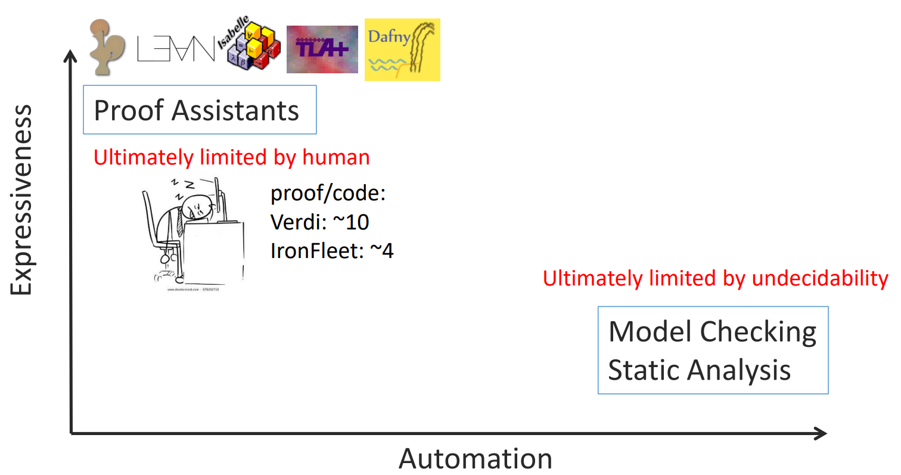

<div style="display: flex; justify-content: center; align-items: center; height: 700px;">
  <div style="text-align: center; padding: 40px; background-color: white; border: 2px solid rgb(0, 63, 163); border-radius: 20px; box-shadow: 0 0 20px rgba(0,0,0,0.1);">
    <h1 style="font-size: 48px; font-weight: bold; margin-bottom: 20px; color: #333;">Refinement Type for Oat</h1>
    <p style="font-size: 24px; color: #666;">A simple refinement type language</p>
    <p style="font-size: 16px; color: #999; margin-top: 20px;">Hengyu Ai | 2025-06-04 </p>
  </div>
</div>

<!--s-->

<div class="middle center">
  <div style="width: 100%">

  # Part.1 What is Refinement Type?
  
  </div>
</div

<!--v-->

## Bugs that type system can catch

- Incompatible types
- Missing or extra arguments
- Exhaustiveness checking

<div class="fragment">

However, there are still many bugs that type system cannot catch, such as:

- Div by zero
- Out of bound access
- Mismatch demension (these bugs are became more common with the rise of machine learning)

</div>

<div class="fragment">

  <b>A basic type system is not enough.</b>

</div>

<!--v-->

## Verification



<!--v-->

## Refinement Type

A "smart" dependent type.

- In dependent type, types can be "concrete" values.
- In refinement type, types are enriched with predicates.

$$
x : B \\{ p \\}
$$

where $B$ is a type and $p$ is a predicate.

Key points: quantifier free arithmetic logic, totally decidable.

<!--v-->

## Parts similar to Dafny

- Precondition and postcondition
- Path sensitivity, e.g. when checking `if` statement, the type of the variable can be refined to the branch taken.
- Able to do some automatic reasoning

<br/>

## Parts different from Dafny

- No quantifier
- Not Floyd-Hoare logics

<!--v-->

## Dafny vs Refinement Type

The main algorithmic problem with classical Floyd-Hoare logic is that to do useful things, you need to use **universally quantified** logical formulas inside invariants, pre- and post-conditions: `forall x. P(x)`

The solver doesn't know which particular term `x` to instantiate, so you may found adding `assert` in Dafny helpful while `assert` has no semantic meaning in your program.

Types decompose quantified assertions into quantifier-free refinements.

<!--v-->

## Accessing a list in Dafny

```dafny
datatype List<a> = Nil | Cons(head: a, tail: List<a>)

function elements<a>(xs: List<a>): set<a>
{
  if xs == Nil then {}
  else {xs.head} + elements(xs.tail)
}

function method ith<a>(xs: List<a>, i: int, def: a): (res: a)
ensures res in elements(xs) + {def} {
  match xs {
    case Cons(h, t) => if i == 0 then h else ith(t, i - 1, def)
    case Nil => def
  }
}
```

<!--v-->

## Accessing a list in Refinement Type

```haskell
data List a = Nil | Cons {head :: a, tail :: List a}

ith :: List a -> Int -> a -> a
ith xs i def = case xs of
  Nil -> def
  Cons h t -> if i == 0 then h else ith t (i - 1) def
```

The constraints are parametrized by the type of the list, so the refinement type can be inferred from the context.

<!--v-->

## List size

Dafny:

```dafny
function size<a>(xs: List<a>): nat
{
  match xs {
    case Nil => 0
    case Cons(h, t) => 1 + size(t)
  }
}
```

Liquid Haskell:

```haskell
{-@ measure n @-}
size :: List a -> Int
size xs = case xs of
  Nil -> 0
  Cons _ t -> 1 + size t
```

<!--v-->

## List size

With a more type-centric view, we can think of the recursive function size as a way to decorate or refine the types of the data constructors.

```haskell
data List a where
  Cons :: h:a -> t:List a -> {v:List a | size v == 1 + size t}
  Nil  :: {v:List a | size v == 0} 
```

<!--v-->

## Verifying size

```dafny
method test(x: int)
{
  var ls := Cons(0, Cons(x, Nil));
  assert size(ls) == 2;
}
```

```haskell
test x = 
  let ls = Cons 0 (Cons x Nil)
  in assert (size ls == 2) ()
```

To get Dafny to verifier to sign off on the `assert (size(pos) == 2)` we have to add a mysterious extra assertion that checks the size of the intermediate value `Cons (1, Nil)`. (Without it, verification fails.)

The SMT solver doesn't know where to instantiate the size axom. Dafny's instantiation heuristics come up short. The user must manually add the assertion.

<!--s-->

<div class="middle center">
  <div style="width: 100%">

  # Part.2 Demo
  
  </div>
</div>

<!--v-->

## Demo in editor

<!--s-->

<div style="display: flex; justify-content: center; align-items: center; height: 700px;   ">
  <div style="text-align: center; padding: 40px; background-color: white; border-radius: 20px; box-shadow: 0 0 20px rgba(0,0,0,0.1);">
    <div style="display: inline-block; padding: 20px 40px; border-radius: 10 px; margin-bottom: 20px;">
      <h1 style="font-size: 48px; font-weight: bold; margin: 0; color: rgb(16, 33, 89)">Thanks for Listening</h1>
    </div>
    <p style="font-size: 24px; color: #666; margin: 0;">Any questions?</p>
  </div>
</div>


